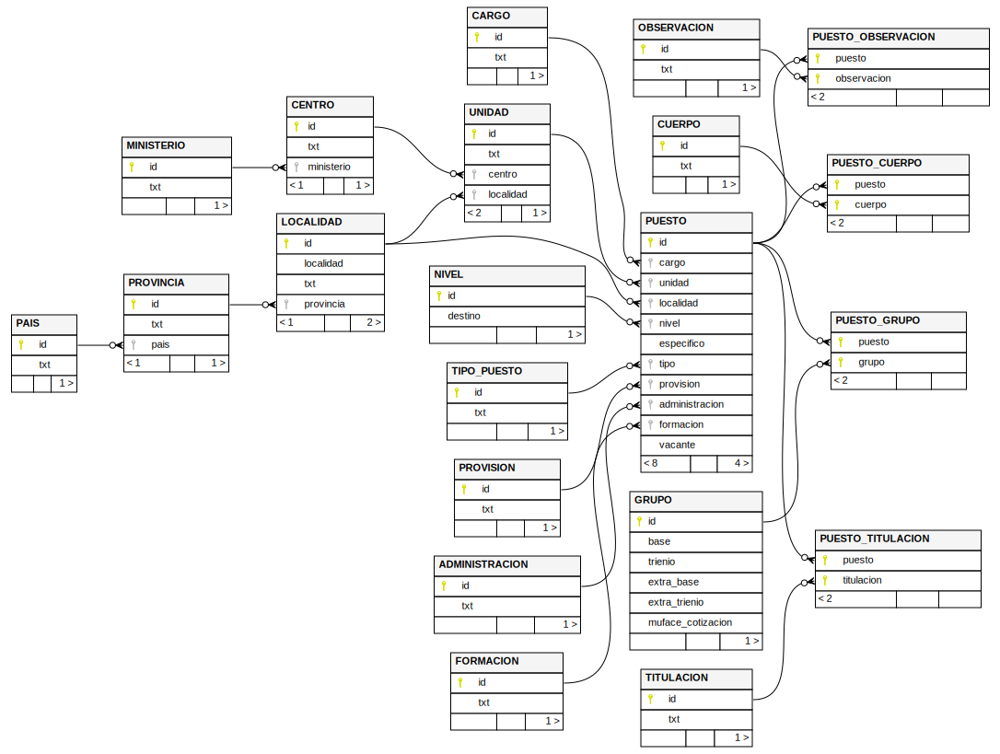

Crea una base de datos `sqlite` a partir del:

* [Muface](https://www.muface.es/muface_Home/mutualistas/cotizacion/Regimen-de-Cotizaciones.html)
* [RPT](https://transparencia.gob.es/content/dam/transparencia_home/publicidadactiva/organizacionyempleo/rpt/actual-junio-2025/total/250901-RPT-Tabla%20conjunta%20PF.xlsx) (via [transparencia.gob.es](https://transparencia.gob.es/transparencia/transparencia_Home/index/PublicidadActiva/OrganizacionYEmpleo/Relaciones-Puestos-Trabajo.html))
* [Retribuciones](https://www.sepg.pap.hacienda.gob.es/sitios/sepg/es-ES/CostesPersonal/EstadisticasInformes/PublishingImages/Paginas/RetribucionesPersonalFuncionario/Retribuciones%20del%20personal%20funcionario.%20Real%20Decreto-ley%204%202024%20%202%25%20+0.5%25%20IPCA.pdf) (via [sepg.pap.hacienda.gob.es](https://www.sepg.pap.hacienda.gob.es/sitios/sepg/es-ES/CostesPersonal/EstadisticasInformes/Paginas/RetribucionesPersonalFuncionario.aspx))

# Resultado

- [age.sqlite](https://s-nt-s.github.io/age-db/age.sqlite)
- Esquema de base de datos:

# Tratamiento del excel de la RPT

Para normalizar los datos de la RPT se han tomado las siguientes decisiones:

## Jerarquía País - Provincia - Localidad

En la RPT todas las localidades de países distintos de España están asignadas
a una misma provincia (la `60 EXTRANJERO`), para evitar el problema que
esto representa al trasladar los datos a `sqlite` (ya que violaría la
`primary key` de la tabla `PROVINCIA`) se crea por cada país extranjero
una provincia con mismo `txt` y con `id` igual al del país cambiado de signo.

## Jerarquía Ministerio - Centro - Unidad

Normalmente una unidad esta dentro de un centro que a su vez esta dentro
de un ministerio, sin embargo en la RPT aparecen unidades que no tienen
centro.

Para poder generalizar la jerarquía `Ministerio - Centro - Unidad` se
ha optado por que cada unidad que no tenga centro crearle una con mismo
`txt` y con `id` igual al de la unidad cambiado de signo.

## Cuerpo

Se ha definido la relación `<puesto, cuerpo>` como de `1 a n`,
en vez de `1 a 1`, para no tener que usar _cuerpos mixtos_ como `A1A2`
y simplemente relacionar cada puesto con todos los cuerpos a los que pertenece.

## Observaciones

Se ha definido la relación `<puesto, observación>` como de `1 a n`,
en vez de `1 a 1`, para que en vez de usar observaciones concatenadas por `,`
relacionar el puesto con todas sus observaciones.

## Titulaciones

Se ha definido la relación `<puesto, titulaciones>` como de `1 a n`,
en vez de `1 a 1`, para que en vez de usar titulaciones concatenadas por `,`
relacionar el puesto con todas sus titulaciones.

## Estado

El campo `estado` del excel solo indica si el puesto es vacante o no,
por lo tanto se guarda en base de datos como una columna `vacante`
que es `1` cuando es `true` y `0` cuando es `false`.

## [Claves](CLAVES.md)

Algunas claves están relacionadas con otras en su descripción.
Cuando esto ocurre se relaciona el puesto tanto con la _clave padre_
como con sus _hijas_.

Por ejemplo, si un puesto tienen como observación `Y71`, cuya
descripción es `C80 - C81 - C84`, se le asignara una relación
con cada uno de los códigos (`Y71`, `C80`, `C81`, `C84`).

Por otro lado, todas claves que son necesarias (porque aparecen
relacionadas con un puesto) pero no aparecen en la leyenda
de la segunda hoja del excel han sido añadidas a las tablas
con la descripción `¿?`.

## Cargo

En el excel aparecer por cada puesto una denominación corta y
una denominación larga. La primera es descartada y la segunda
(la denominación larga) es guardad como el *cargo* del puesto.

## Cuerpos *hasta 27/07/2007*

Hay varios cuerpos `EX**` cuya descripción es del tipo
`EX**+EX**+EX**+... (hasta 27/07/2007) +EX**+EX**+...`.

Para estos casos se ha decidido interpretar que la parte
`EX**+EX**+EX**+... (hasta 27/07/2007)` ya no aplica y por
lo tanto se ha eliminado esa parte de la relación.

## Tipo puesto

En la RPT aparecen algunos puestos con tipo puesto `P`
(Pendiente de clasificar) y tipo puesto igual a `null`.

Como creo que es lo mismo, e eliminado el tipo puesto `P`
y he dejado esos puestos con tipo igual a `null`.